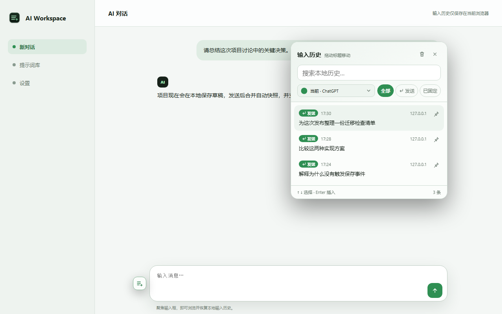
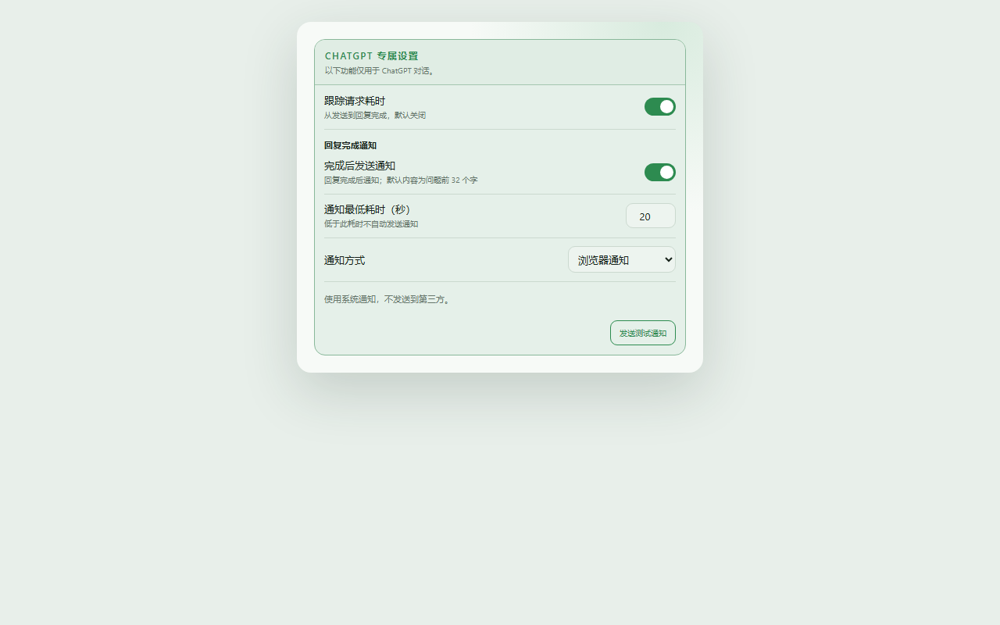
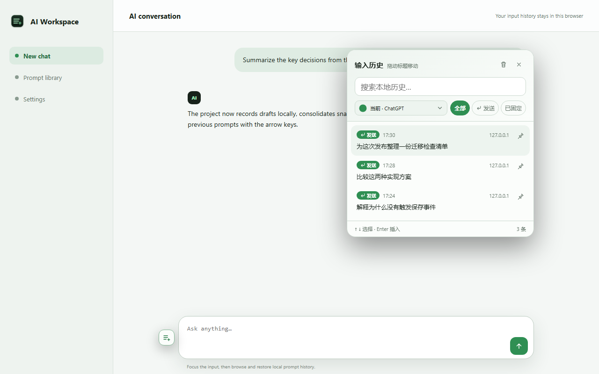
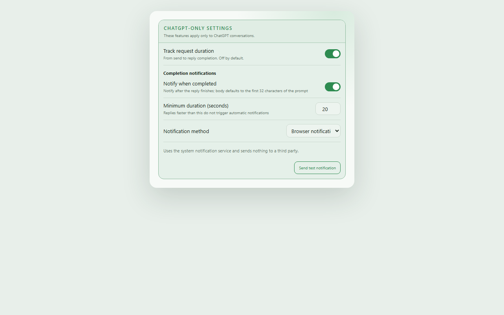

# AI 输入历史

面向 Chrome、Edge 等 Chromium 浏览器的 Manifest V3 扩展。它会识别网页中的聊天输入框，将草稿、定时快照和实际发送前的内容保存在 `chrome.storage.local`。输入历史默认不上传；只有用户主动启用第三方或自定义回复完成通知时，才会向所配置的通知服务发送通知内容。

## 扩展截图

以下截图由项目内置演示页和真实设置页自动生成，使用示例数据，不包含真实聊天内容。

### 中文界面





<details>
<summary>查看英文界面</summary>





</details>

## 功能

- 默认只在内置 AI 网站启用；可在扩展设置中添加自定义域名，启用该网站的 `textarea`、`contenteditable` 和聊天文本框追踪。
- 内置 Gemini、Grok、GLM、Qwen、ChatGPT、Claude、Google AI Studio、DeepSeek、Copilot、Perplexity、Kimi、豆包、腾讯元宝、文小言、Mistral、Poe、Meta AI 和 You.com 的站点识别与本地品牌图标资源，并增强常见富文本输入框和发送按钮识别。
- Copilot、Perplexity、Kimi、豆包包含独立的输入框与发送按钮选择器；支持 Copilot 开放 Shadow DOM、Kimi/豆包 Slate 富文本编辑器及 Perplexity 问答输入框。
- 输入时持续保存当前草稿，自动快照间隔按秒配置（默认 60 秒，范围 1–3600 秒）；内容未变化时不会重复写入。
- 根据页面的真实提交行为识别发送：表单提交、发送按钮点击、输入框实际清空，或网页拦截 Enter 且内容保持不变时才记录；Enter/Shift+Enter 产生换行或正文变化时不会误标记。
- 对内置 AI 网站，网页拦截发送快捷键后会观察短暂窗口，确认没有换行或内容变化再保存发送尝试；点击发送按钮也会记录。页面请求失败时仍可恢复已保存输入，但扩展无法确认服务器是否收到消息。自定义域名使用页面清空/提交行为判断。
- 未固定历史默认保留最近 100 条，未固定发送记录默认最多保留 10 条；固定消息不占这些限额。
- 输入框左侧显示悬浮历史按钮，长按按钮可自由拖动；历史面板可拖动标题调整位置，位置按网站保存在本地。
- 悬浮按钮支持右键隐藏，并可在扩展设置中重新开启；历史快捷键可录制为自定义组合键，也可以完全停用。
- 历史面板默认仅显示当前网站记录；带 AI Logo 的自定义下拉菜单将“全部网站”置于首项，并可切换其他网站。面板同时支持全文搜索、“仅发送记录”筛选和一键清除。
- 网站图标只读取页面内嵌图片或同源 favicon，不携带 Cookie、来源地址或跟随重定向；不可读取时保留本地图标。
- 历史面板会识别网页的 `dark` / `data-theme` / `color-scheme` 和背景亮度，网站切换深浅主题时自动同步，无需刷新。
- 默认在输入框中按 `Ctrl+R` 打开历史；面板内用上下键选择、Enter 插入、Esc 关闭。
- 输入框内直接按上/下键会像 Chrome DevTools Console 一样切换历史，向下越过最新记录后恢复切换前的文本。
- 扩展弹窗可调整历史上限、发送记录上限和自动快照间隔，并可在中英文之间即时切换。
- ChatGPT 回复完成通知默认关闭；可选择浏览器系统通知、Bark、Server酱、PushPlus、ntfy、Gotify、钉钉机器人、飞书机器人、企业微信机器人，或配置自定义 HTTP 请求。默认通知最低耗时为 20 秒，低于阈值的快速回复不会自动通知；测试通知不受该阈值限制。默认通知正文只取问题前 32 个字符，纯图片/附件请求使用专用提示。
- 页面面板和扩展设置页都能清空未固定历史，固定消息会保留；删除前显示确认弹窗。

## 安装

1. 打开 `chrome://extensions` 或 `edge://extensions`。
2. 开启“开发者模式”。
3. 选择“加载已解压的扩展”，加载本项目目录。
4. 刷新已打开的 AI 网站，在聊天输入框获得焦点后即可使用。

## ChatGPT 回复计时

在扩展设置中开启“跟踪请求耗时”（默认关闭，仅 ChatGPT）。发送后悬浮按钮显示当前已用秒数，观察到新回复完成后恢复历史图标。历史记录右下角显示从发送到回复完成的总耗时和完成时刻；鼠标悬停或键盘聚焦记录时，发送时间精确到秒。

计时基于网页生成状态和新回复的完成控件，不拦截网络、不保存 GPT 回复正文，也不是服务器耗时或首字延迟。取消生成、关闭开关、切换已有对话或检测到异常时结束观察但不虚构完成时间；30 分钟仍未检测到完成会停止计时。进行中的计时按 ChatGPT 会话 URL（域名 + pathname）临时保存在本地：F5、关闭标签页后重新打开同一 `/c/...` URL，甚至重启浏览器后重新打开该会话，都可以继续使用原始发送时间累计；打开其他会话 URL 不会恢复。新对话从 `/` 获得 `/c/...` 地址后，活动计时会迁移到确定的会话 URL。活动状态最长保留 30 分钟，完成、取消、失败或超时后立即清除。旧记录不会补算耗时。网页改版或特殊回复模式缺少完成标记时可能无法记录完成，界面会显示未完成状态。

## ChatGPT 回复完成通知

在扩展设置中开启“完成后发送通知”后，ChatGPT Web 确认一轮回复正常完成时才发送通知。通知最低耗时默认 20 秒：回复总耗时低于阈值时自动通知会被跳过，达到或超过阈值才发送；可在设置中调整为 0–3600 秒，设为 0 表示不按耗时过滤。测试通知始终绕过最低耗时，用于单独验证通知渠道。默认正文为本次问题前 32 个字符，超出部分用 `…` 省略；纯图片或附件请求使用“图片或附件请求”。取消生成、失败、超时或切换对话不会发送完成通知。

内置支持浏览器系统通知、Bark、Server酱、PushPlus、ntfy、Gotify、钉钉机器人、飞书机器人和企业微信机器人；也支持自定义 HTTP 请求。三个企业群机器人直接粘贴完整 Webhook URL 即可。自定义请求可使用 `{{title}}`、`{{message}}`、`{{question}}`、`{{duration}}`、`{{completedAt}}`、`{{pageUrl}}` 模板变量。完整配置见 [回复完成通知说明](docs/completion-notifications.md)。

## 快捷键说明

`Ctrl+R` 是默认值，也是浏览器原生刷新快捷键。扩展只在识别到的聊天输入框获得焦点时拦截它；未聚焦聊天框时仍执行页面刷新。可以在扩展设置中录制其他组合键或停用快捷键。

## 隐私与权限

- `storage`：在浏览器本地保存输入历史、草稿、通知配置和其他设置。
- 可选 `notifications`：仅在用户选择浏览器系统通知时申请。
- 可选网站权限：仅在用户启用第三方机器人/推送或自定义请求时，按实际目标域名申请，用于发送完成通知。
- `<all_urls>` 内容脚本：覆盖内置 AI 网站与用户添加的域名。扩展不读取聊天网络响应，不发送遥测；只可能请求当前网站的同源图标。

输入历史默认保持本地。只有用户主动启用第三方通知时，通知摘要以及用户显式放入自定义模板的变量才会发送到其配置的服务；Webhook、Token 等通知凭据保存在浏览器本地。密码框、禁用输入框和无法编辑的元素不会被记录。

## 开发验证

```powershell
npm test
npm run build
```

项目没有运行时依赖；开发时可直接加载源码目录，商店发布使用下方打包命令。

## Chrome Web Store 发布

商店图标、宣传图、双语实际界面截图、商店文案、隐私政策和提交检查清单位于 `store-assets/`。重新生成双语历史面板与 ChatGPT 专属设置截图：

```powershell
npm run screenshots:store
```

重新生成图标和宣传图：

```powershell
npm run assets:store
```

生成可上传的 ZIP：

```powershell
npm run package:store
```

ZIP 会输出到 `dist/ai-input-history-<version>.zip`，且 `manifest.json` 位于压缩包根目录。正式提交前必须替换隐私政策中的 `{{PUBLISHER_EMAIL}}`，并将隐私政策发布到公开 HTTPS 地址。

## 固定消息

自动发布配置与一次性云端授权步骤见 [Chrome Web Store CD](docs/chrome-store-cd.md)。

点击记录右侧图钉可固定或解除固定；“已固定”筛选可与网站和搜索共同使用。固定消息不占普通缓存上限，不会被自动淘汰、发送合并或一键清空删除。解除固定后恢复普通保留规则，可能立即被淘汰。固定草稿会保存点击时内容的独立快照。固定记录仍受浏览器存储容量限制，卸载扩展会移除本地数据。
